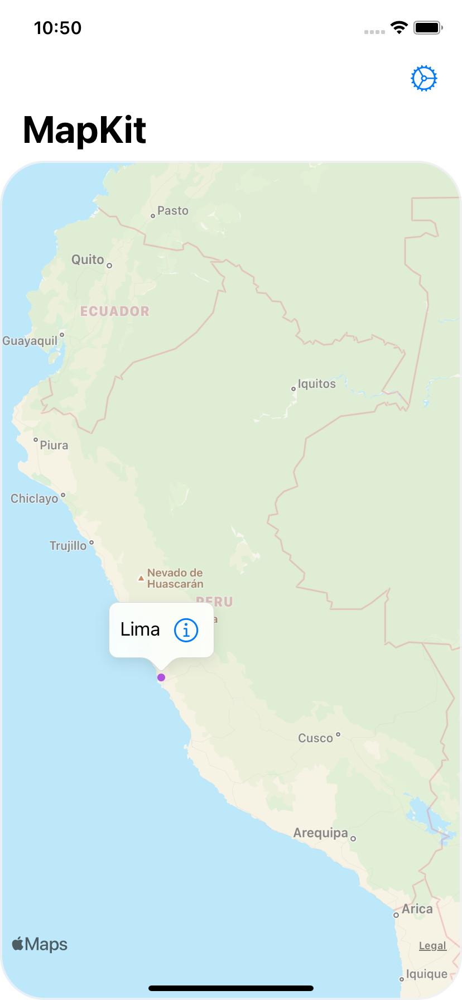
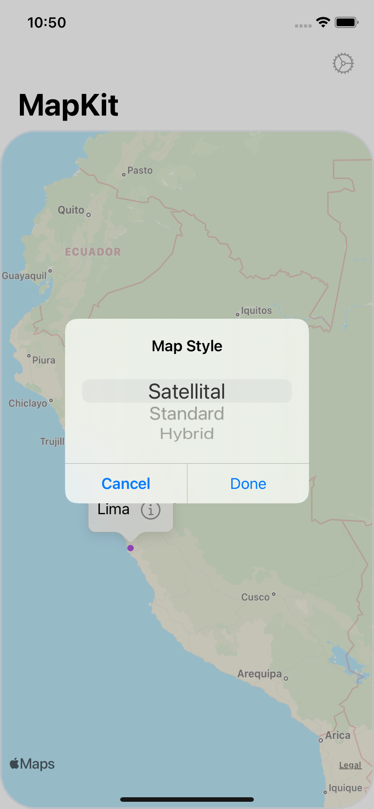

# MapKitLibrary 🗺
MapKitLibrary is an iOS app for testing the usage and functionallity of Apple's **MapKit** library. It has 2 landmarks (Lima, Peru & Tokyo, Japan) which, when tapped, show their respective Wikipedia pages from an HTTP request.

## Screenshots & Demo
| Map | Select Map | Wikipedia View | Demo |
| --- | --- | --- | --- |
|  |  |  |  |
